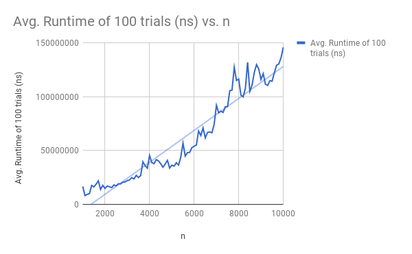

# PotatoChips
## Lab00 - Algorithm Runtime Experimentation 
### Daniel Gelfand, Tabassum Fabiha, Shayan Chowdhury

## Hypothesis
The correlation between n and runtime will represent a linear relationship.

## Background
As the length of an array changes, the time to execute an algorithm that finds a given value in the array increases. This experiment explores the relationship between the length of the array(independent variable) and the runtime to find the true Big-O representation.

## Methodology
We will find the worst-case value (across the diagonal) for each matrix starting from a size 1000x1000 to 10000x10000 in increments of 100. This will be done 100 times for each matrix to represent 100 trials. The change in the length of the matrix will be the only independent variable of the experiment. The runtimes for each matrix will be averaged and then plotted on a graph with the correlating length of the matrix.

## Data

## Conclusions
The data does support the hypothesis that our algorithm runs in O(n) time since the data plotted on our graph looks almost completely linear around a line of best fit. There are many fluctuations in the graph, however, that could be attributed to problems with memory allocations, CPU usage among other errors. 
